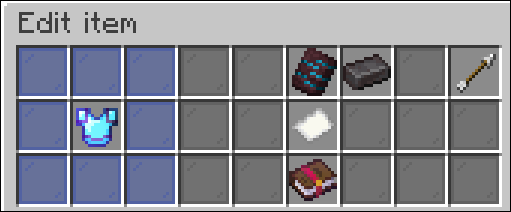
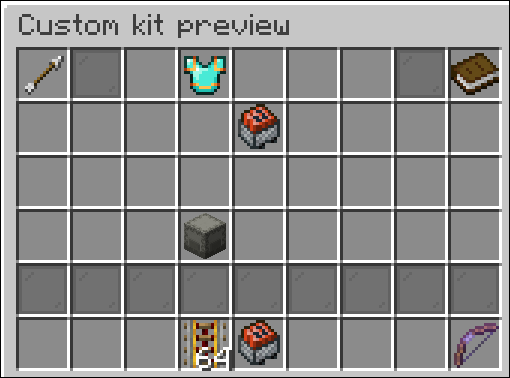
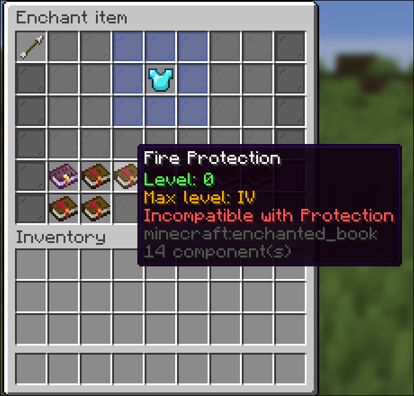
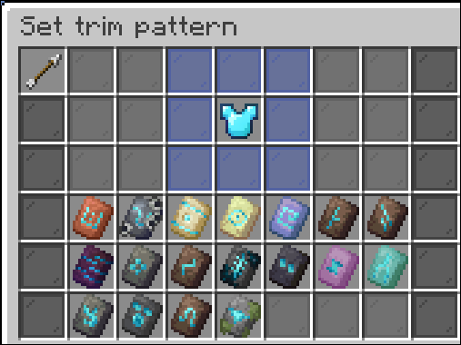
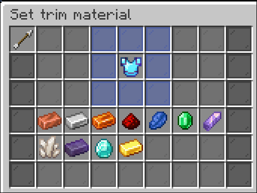
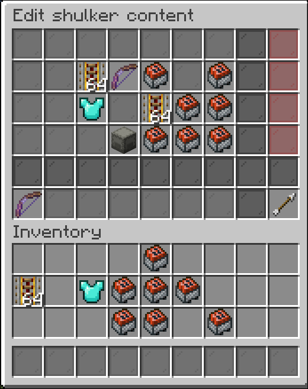

# KitCats


**Building**:
```shell
git clone https://github.com/JGJ52/KitCats.git
cd KitCats
./gradlew build
```

**Configuring**:
In config.yml, you can 
\
change the messages, 
\
the content of the pages and the kits and the custom kits (you can change these in-game too, so don't worry about these!)
\
you can also disable enchantments in config:
```yaml
customkits:
  enchants:
    disabled: 
      - mending
      - unbreaking
```

**Commands**:
- /kit:
  - subcommands:
    - create: create a kit
    - delete: delete a kit
    - edit: edit a kit (it edits it only for you!)
    - load: load a kit into your inventory
    - preview: preview a kit's content
  - default behavior: opens up a gui containing all the kits
- /customkit:
  - subcommands:
    - create: create a custom kit
    - delete: delete a custom kit
    - edit: edit one of your custom kit's content **note: you can edit the items by shift-clicking them**

      
    - load: load one of your custom kit into your inventory
    - preview: preview one of your custom kit

      
  - default behavior: opens up a gui containing all your custom kits
- /page:
  - default behavior: opens up a gui where you can edit, what players can put into their custom kits. must get ran at least once before using /customkit

**Permissions**:

for each command, the permission is 
```yaml
kitcats.command.<command>
```
for each subcommand, the permission is 
```yaml
kitcats.command.<command>.<subcommand>
```
in the custom kit's item editor, you need the 
```yaml
kitcats.customkits.<editType>
```
permission.

Edit types:
- name: edit the name of the item
- enchant: let the player enchant the item


- trim: let the player put trims on an armor



- shulker: let the player edit the content of a shulker box

